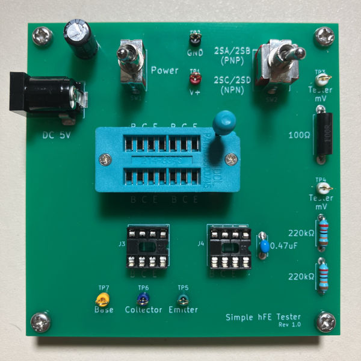
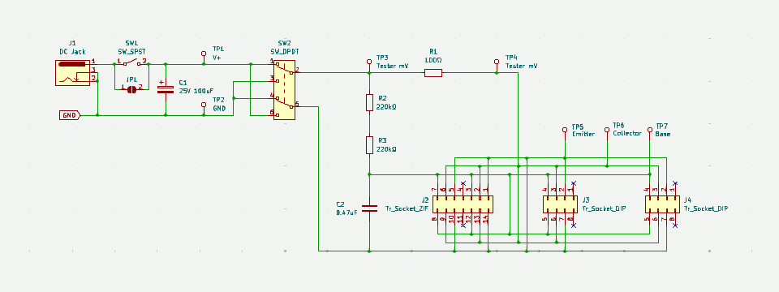
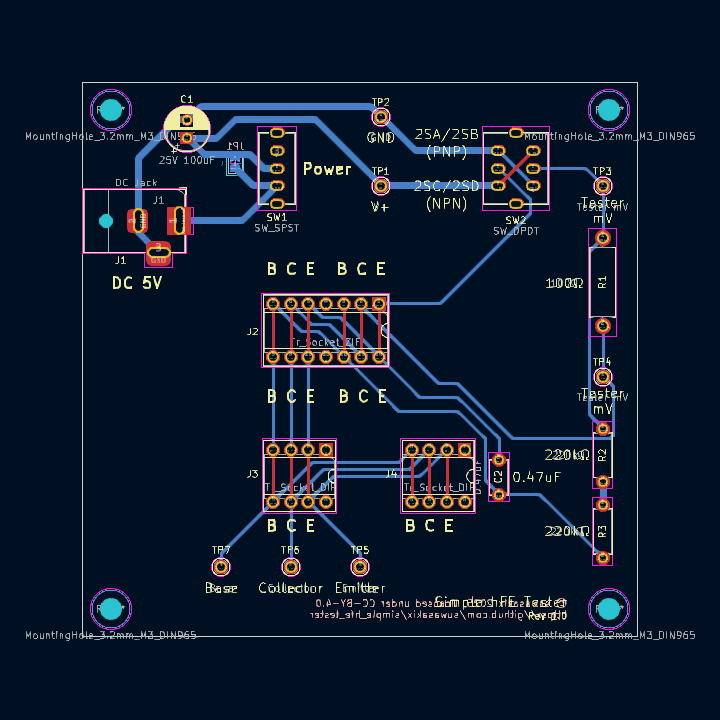
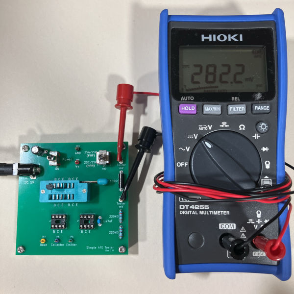
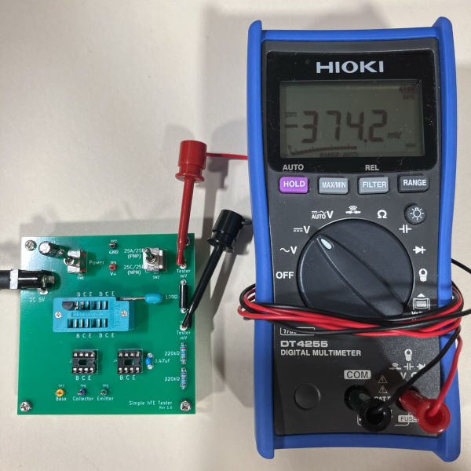

# Simple hFE Tester

トランジスタ hFE 簡易測定器

&nbsp;

## 目次 - Contents

 - [このプリント基板について](#このプリント基板について---about-this-pcb)
 - [ガーバーデータのダウンロード](#ガーバーデータのダウンロード---download-gerber-data)
 - [部品リスト](#部品リスト---parts-list)
 - [便利なアイテム](#便利なアイテム---useful-items)
 - [使用例](#使用例---example-of-use)
 - [回路図](#回路図---pcb-schematic)
 - [レイアウト](#レイアウト---pcb-layout)
 - [開発環境](#開発環境---development-environment)
 - [ライセンスについて](#ライセンスについて---license)

&nbsp;

## このプリント基板について - About this PCB

このプリント基板は、ぺるけさんの [hFEテスター](http://www.op316.com/tubes/mi-audio/hfe-tester.htm) のページで紹介されている簡単版 hFE テスターの回路を実装したものです。  

この基板はトランジスタの直流電流増幅率 (hFE) の簡易測定を目的としたものであり、自作のアンプに使用する半導体部品を選別するのに向いています。選別した半導体部品を第三者に頒布することを目的とする場合は、電流と電圧の両方を調整できるような高機能な測定器が必要になると思います。  

&nbsp;

## ガーバーデータのダウンロード - Download gerber data

こちらのページから「simple_hfe_tester-gerber.zip」のファイルをダウンロードしてください。  

&emsp; https://www.github.com/suwasakix/simple_hfe_tester/releases

このプロジェクトは、各自がプリント基板のガーバーデータをダウンロードして PCB 基板メーカーに基板製造を発注することを前提にしています。個人で発注可能な PCB 基板メーカーは国内外問わずありますが、近年では 10cm 四方以下の基板サイズであれば海外メーカーで格安に製造委託することが可能になりました。発注例として、深圳の Seeed studio が提供する PCB 製造サービス「[Fusion PCB](https://www.fusionpcb.jp)」に基板製造を発注する方法を[こちらのページ](docs/ORDER_PCB.md)で紹介しておきます。

&nbsp;

## 回路図 - PCB schematic

回路の説明は hFE テスターのページに書かれている通りで、測定するトランジスタに 10μA のベース電流が流れるとき 100Ωの両端にかかる電圧から hFE の値を測定します。例えば hFE が 100 のトランジスタの場合、コレクタ電流は 10μA × 100 = 1000μA = 1mA になるので、100Ω にかかる電圧は 1mA × 100Ω = 100mV になります。つまり、テスターで測定した mV の値がそのまま hFE の値になります。

R1 は電流値を測定するための抵抗なので高精度品か、あるいは抵抗値を実測してなるべく 100Ω に近いものを使用してください。

C2 の 0.47uF には積層セラミックコンデンサを使用してください。アルミ電解コンデンサは使用できません。

電源には 5V の AC アダプターか、USB-DC 電源ケーブルを使用してください。DC ジャックは 外径 5.5mm / 内径 2.1mm センタープラスのものが適合します。

&nbsp;

## レイアウト - PCB layout

* 基板サイズ : W 80mm × H 80mm

## 部品リスト - Parts list

* 通販による部品販売では、10個単位などでまとめ売りされている場合がしばしばあります。注文の際にはご注意ください。
* ★ は省略可。
* ☆ は使用しなければ省略可。

|部品種別			|記号					|部品名															|値				|個数		|入手ルート																												|
|:----:				|:----:					|:----:															|:----:			|:----:		|:----:																													|
|抵抗				|R1						|金属皮膜抵抗 1/4W												|100Ω			|1			|[高精度 金属皮膜抵抗 1/2W100Ω ±0.1%][AK_108509_R100] [高精度 金属皮膜抵抗 1/4W100Ω ±0.1%][AK_108504_R100]		|
|					|R2, R3					|金属皮膜抵抗 1/4W												|220kΩ			|2			|[小型 金属皮膜抵抗 1/2WS 220kΩ 1袋100本入][AK_116658_R220k]															|
|コンデンサ			|C1						|電解コンデンサ (直径 6.3mm, リードピッチ 2.5mm)			|100μF			|1			|[100μF35V105℃ ルビコンZLH][AK_102724_C35v100u]																		|
|					|C2						|積層セラミックコンデンサ (リードピッチ 5.0mm)				|0.47μF		|1			|[積層セラミックコンデンサー 0.47μF50V X7R 5mm][AK_108148_C50v0.47u]													|
|スイッチ			|SW1 ★					|トグルスイッチ (3P 1回路2接点 ON-ON)						|-				|1			|[2MS1-T1-B4-M2-Q-E][AK_102399_SW_2MS1-T1-B4-M2-Q-E] [2MS1-T1-B4-VS2-Q-E-S][AK_100300_SW_2MS1-T1-B4-VS2-Q-E-S]		|
|					|SW2					|トグルスイッチ (6P 2回路2接点 ON-ON)						|-				|1			|[2MD1-T1-B4-VS2-Q-E][AK_104028_SW_2MD1-T1-B4-VS2-Q-E] [2MD1-T2-B4-M2-Q-N][AK_100301_SW_2MD1-T2-B4-M2-Q-N]			|
|チェック端子		|TP1 ～ TP7 ☆			|チェック端子													|-				|7			|[チェック端子][AK_C_CCHECKTER]																							|
|ソケット			|J1						|基板型DCジャック (内径2.1mm, 外径5.5mm)						|-				|1			|[MJ-179P][AK_100077_MJ-179P] [2DC0005D100 1パック4個入][AK_101604_2DC0005D100]										|
|					|J2 ☆					|14ピン ゼロプレッシャーICソケット							|-				|1			|[ゼロプレッシャーICソケット 14P][AK_112073_ULO-ZS431-14P1G]															|
|					|J3, J4 ☆				|8ピン 板バネICソケット											|-				|2			|[2227-08-03 1パック10個入][AK_100017_2227-08-03]																		|
|基板スペーサー		|						|黄銅六角スペーサー M3×10mm									|-				|4			|[FB3-10][AK_107313_FB3-10]																								|
|					|						|M3 ネジ								 						|-				|4			|(ホームセンター等で入手可能)																							|

[AK_108509_R100]:								https://akizukidenshi.com/catalog/g/g108509/
[AK_108504_R100]:								https://akizukidenshi.com/catalog/g/g108504/
[AK_116658_R220k]:								https://akizukidenshi.com/catalog/g/g116658/
[AK_102724_C35v100u]:							https://akizukidenshi.com/catalog/g/g102724/
[AK_108148_C50v0.47u]:							https://akizukidenshi.com/catalog/g/g108148/
[AK_102399_SW_2MS1-T1-B4-M2-Q-E]:				https://akizukidenshi.com/catalog/g/g102399/
[AK_100300_SW_2MS1-T1-B4-VS2-Q-E-S]:			https://akizukidenshi.com/catalog/g/g100300/
[AK_104028_SW_2MD1-T1-B4-VS2-Q-E]:				https://akizukidenshi.com/catalog/g/g104028/
[AK_100301_SW_2MD1-T2-B4-M2-Q-N]:				https://akizukidenshi.com/catalog/g/g100301/
[AK_C_CCHECKTER]:								https://akizukidenshi.com/catalog/c/ccheckter/
[AK_100077_MJ-179P]:							https://akizukidenshi.com/catalog/g/g100077/
[AK_101604_2DC0005D100]:						https://akizukidenshi.com/catalog/g/g101604/
[AK_112073_ULO-ZS431-14P1G]:					https://akizukidenshi.com/catalog/g/g112073/
[AK_100017_2227-08-03]:							https://akizukidenshi.com/catalog/g/g100017/
[AK_107313_FB3-10]:								https://akizukidenshi.com/catalog/g/g107313/

R1 は金属皮膜抵抗の高精度品を使用するか、あるいは誤差±1%の金属皮膜抵抗から選別したものを割り当てます。普及価格帯のデジタルマルチメーターの場合、抵抗値の確度（測定誤差）はおおよそ ±0.5% ～ ±1.0% といったところなので、高精度品を使用した方が外れは少ないことになります。ただし、高精度品を使用する場合でも部品の不良チェックのために抵抗値は実測しておくようにしてください。

SW1 は電源スイッチですが、省略することもできます。省略する場合は JP1 のパターンをショートしてください。

J2 は中大型トランジスタ、J3, J4 は小型トランジスタ用のソケットです。使わないソケットは省略することもできます。TP5 ～ TP7 から線出しして IC クリップで測定するトランジスタを繋いでもよいです。

&nbsp;

## 便利なアイテム - Useful items

|部品名																			|入手ルート																							|
|:----:																			|:----:																								|
|ACアダプター 5V (DCプラグ内径2.1mm, 外径5.5mm, センタープラス)			|[AD-T50P200][AK_111996_ACDC5V_AD-T50P200] [M050200-A010JP][AK_111996_ACDC5V_M050200-A010JP]		|
|USB-DC電源ケーブル (DCプラグ内径2.1mm, 外径5.5mm, センタープラス)		|[DC-5521A][SG_5AK2-DTDU_DCP_DC-5521A]																|
|テストリード (バナナプラグ ⇔ ICクリップ)									|[TLA-106][AK_112359_TLA-106]																		|
|テストリード (ICクリップ両端)												|[TLA-105][AK_112419_TLA-105] [TLA-101][AK_111765_TLA-101]										|

[AK_111996_ACDC5V_AD-T50P200]:					https://akizukidenshi.com/catalog/g/g111996/
[AK_111996_ACDC5V_M050200-A010JP]:				https://akizukidenshi.com/catalog/g/g118205/
[SG_5AK2-DTDU_DCP_DC-5521A]:					https://www.sengoku.co.jp/mod/sgk_cart/detail.php?code=5AK2-DTDU
[AK_112359_TLA-106]:							https://akizukidenshi.com/catalog/g/g112359/
[AK_112419_TLA-105]:							https://akizukidenshi.com/catalog/g/g112419/
[AK_111765_TLA-101]:							https://akizukidenshi.com/catalog/g/g111765/

&nbsp;

## 使用例 - Example of use

型番が 2SC または 2SD で始まるトランジスタ（NPN 型トランジスタ）の場合は、SW2 を下側に合わせて測定します。写真は 2SC1815(GR) を測定した場合で、hFE の値は電圧 (mV) の大きさと同じ 282 になります。

型番が 2SA または 2SB で始まるトランジスタ（PNP 型トランジスタ）の場合は、SW2 を上側に合わせて測定します。写真は 2SA1015(GR) を測定した場合で、hFE の値は電圧 (mV) の大きさと同じ 374 になります。

2SC1815、2SA1015 はいずれも３番ピンがベース端子なので、左側にベース端子がくるようにソケットに差して測定してください。

&nbsp;

## 開発環境 - Development environment

このプリント基板の設計データは、[KiCad](https://www.kicad.org) 9.0 で作成しています。基板のデータは KiCad 9.0 以降で編集することができます。  

なお、この基板のデータを改変するには KiCad ライブラリ [Victwale](https://github.com/suwasakix/Victwale) を必要とします。  

&nbsp;

## ライセンスについて - License

このプリント基板の設計データのライセンスは [Creative Commons CC-BY 4.0 License](https://creativecommons.org/licenses/by/4.0/legalcode) です。

- 上記設計データの著作権は作者 (suwasakix) が保持します。ただし、著作権が生じるのは設計データのレイアウトのみであり、回路図に著作権は生じません。

- 上記設計データは、何の制限もなく私的に利用することができます。データを自由に改変して私的に利用することもできます。

- 上記設計データに変更を加えることなく製造したプリント基板は、商用・非商用を問わず何の制限もなく第三者に頒布することができます。

- 上記設計データの改変物、または改変物をもとに製造したプリント基板（二次創作物）を第三者に頒布するには、原作品が著作権者 (suwasakix) のものであること、および当該作品が二次創作物であることを明示する必要があります。一例としては、原作品の著作権者、および二次創作物の著作権者を当該作品に明示すれば問題ありません。

  - なお、それらを明示する手段は当該作品の実物以外に、当該作品の設計データの一時配布元でもよいものとします（当該作品に著作権者の情報を記載する物理的なスペースがない場合には、一時配布元に著作権者の情報を記載することで代えることが可能です）。その場合、当該作品の実物にデータの一時配布元が記載されていなければなりません。

- 上記設計データの二次創作物には、原作品とは異なるライセンスを適用することができます。

