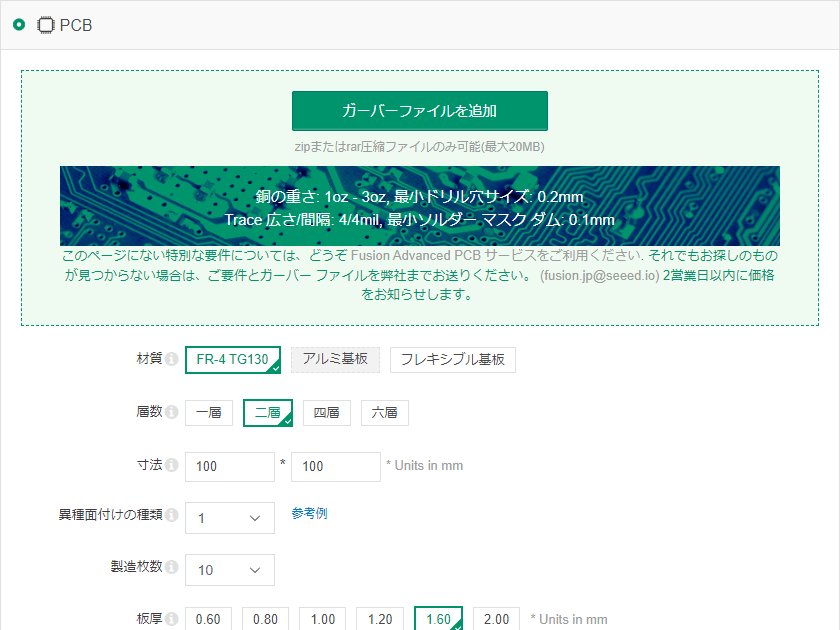
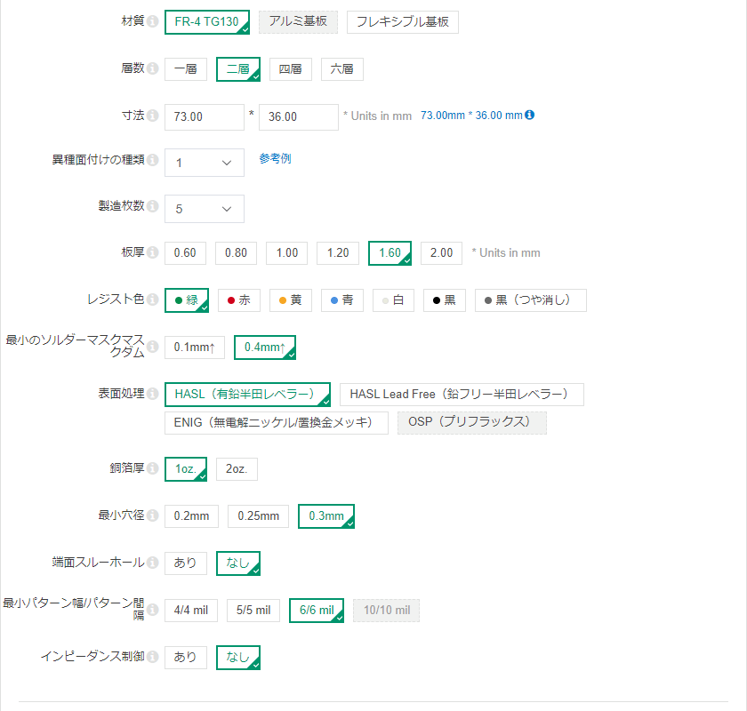

# PCB 基板の発注方法 - How to order PCB

このページでは PCB 基板を発注する方法について説明します。

&nbsp;

## Fusion PCB に基板を発注

[Fusion PCB](https://www.fusionpcb.jp) への基板の発注は、[基板製造見積ページ](https://www.fusionpcb.jp/fusion_pcb.html)から行います。  

&nbsp;

まず、画面にある「ガーバーファイルを追加」をクリックして、Releases のページからダウンロードしたガーバーファイル（ファイル名が「-gerber.zip」で終わるファイル）を選択してください。  

ガーバーファイルを追加後に「ドリル ファイルが見つかりません。 Excellon 形式の NC ドリル ファイルが含まれていることを確認してください。」というメッセージが出ますが、無視して差し支えありません。リポジトリに登録したガーバーファイルにはドリルファイルが含まれており、Fusion PCB で基板が正常に製造されることを確認できております。

&nbsp;

設定パラメータは色々ありますが、一例を以下に示します。  

- 材質 : FR-4 TG130
- 層数 : 二層
- 寸法 : (ガーバーデータから自動的に設定されます)
- 製造枚数 : 最小5枚 (デフォルト:10枚)
- 異種面付けの種類 : 1
- 板厚 : 1.60
- レジスト色 : 緑/赤/黄/青/白/黒 から選択可能 (デフォルト:緑)
- 表面処理 : HASL/HASL Lead Free/ENIG/OSP から選択可能 (デフォルト:HASL)
- 最小のソルダーマスクマスクダム : 0.4mm↑
- 銅箔厚 : 1oz.
- 最小穴径 : 0.3mm
- 端面スルーホール : なし
- 最小パターン幅/パターン間隔 : 6/6 mil
- インピーダンス制御 : なし

基板の寸法が 100mm x 100mm を超えたとたんに金額が１桁跳ね上がるため、基板の大きさは極力これ以下のサイズで設計したいところです。  

製造枚数は最小で5枚を指定することができますが、金額は5枚と10枚とで変わりはありません。  

基板の色はレジスト色で指定することができます。緑色以外も選ぶことができるので、そこは各人の好みで。  

基板の表面処理は HASL (有鉛半田レベラー) が最も低コストですが、RoHS 指令に従わなければいけない人や意識高めの人は鉛フリーの HASL Lead Free にしましょう。金フラッシュでなければ嫌だという人なら ENIG 一択になりますが、お値段もお高くなりますのでそのつもりで。  

板厚など他の設定は、デフォルトのままで問題ないと思います。

設定が終わったら画面右側の「カートに入れる」を選択して、他の基板のオーダーを続けるか、発注手続きを行ってください。  

日本国内であれば、発注から２週間もすれば注文した基板が届くと思います。  

&nbsp;

